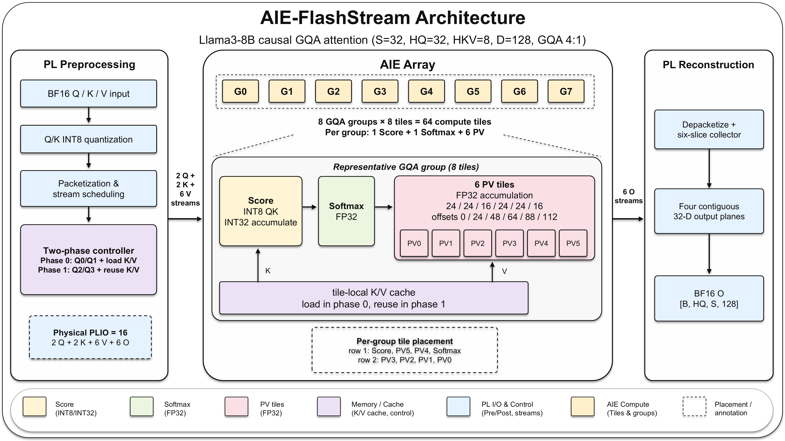

<div align="center">

# AIE-FlashStream

### GQA-Aware LLM Attention Accelerator on AMD Versal AI Engines

**A PL/AIE co-design for Llama3-8B causal GQA, featuring  
stateful two-phase KV reuse and balanced six-way PV parallelization.**

[](#)
[](#)
[](#)
[](#)
[](#)
[](LICENSE)

**🏆 Third Prize — Track B, FPT'26 Design Competition**

</div>

---

<p align="center">
  
</p>

## Highlights

- **135.87× Kernel Speedup**: Reduces dense causal-attention kernel latency from 63.910 ms to **0.470 ms** (median) compared to the Pure-PL baseline.
- **64.74× End-to-End Speedup**: Reduces total request latency (H2D + Kernel + D2H) from 64.373 ms to **0.994 ms** (median).
- **Full 64 AIE Tile Utilization**: Balanced GQA partition across 8 groups (`8 × (1 Score + 1 Softmax + 6 PV) = 64` compute tiles).
- **Two-Phase Stateful K/V Reuse**: Tile-local cache retention eliminates redundant KV stream transfers between query phases.
- **Balanced Six-Way PV Parallelization**: Slice decomposition (`24/24/16/24/24/16`) matches the 4:1 GQA compute demand.
- **High Numerical Precision**: MAE of **3.73e-4** relative to FP32 reference using INT8 Score and FP32 Softmax/PV.
- **Fully Routed 300 MHz Implementation**: Meets all timing constraints (WNS = 0.000 ns) on AMD Versal VCK5000.

## Performance Benchmark (Matched B=1 vs Pure-PL Baseline)

| Metric | Pure-PL V1 Baseline | AIE-FlashStream (Final V21) | Improvement / Speedup |
|---|---:|---:|---:|
| **AIE Compute Tiles** | 0 | **64 tiles** | 8 Score + 8 Softmax + 48 PV |
| **Kernel Latency (median)** | 63.910 ms | **0.470 ms** | **135.87×** (99.26% lower) |
| **Kernel Latency (mean)** | 63.908 ms | **0.475 ms** | **134.59×** |
| **Kernel Min / Max** | 63.865 / 63.931 ms | **0.414 / 0.519 ms** | — |
| **E2E Latency (median)** | 64.373 ms | **0.994 ms** | **64.74×** (98.46% lower) |
| **E2E Latency (mean)** | 64.364 ms | **1.002 ms** | **64.23×** |
| **E2E Min / Max** | 64.283 / 64.407 ms | **0.919 / 1.068 ms** | — |
| **Effective Kernel GFLOP/s** | 0.135 | **18.391** | **135.87×** |
| **Effective E2E GFLOP/s** | 0.134 | **8.700** | **64.74×** |
| **Numerical Accuracy (MAE)** | — | **3.73e-4** | INT8 quantization error |

> The published performance numbers follow the matched isolated-request protocol described in [docs/REPRODUCIBILITY.md](docs/REPRODUCIBILITY.md).

## Final Architecture

The accelerator targets Llama3-8B causal GQA with `S=32`, `HQ=32`, `HKV=8`, `D=128`, where four query heads share each KV head (8 GQA groups).

- **AIE Core Array**:
  ```text
  8 GQA groups × (1 Score + 1 Softmax + 6 PV) = 64 AIE compute tiles
  ```
- **PV Slice Decomposition**: Six parallel PV slices of widths `24/24/16/24/24/16` at dimension offsets `0/24/48/64/88/112`.
- **Physical PLIO Streams**: 16 total streams (2 Q + 2 K + 6 V + 6 O).
- **Two-Phase Execution**:
  - **Phase 0**: Processes Q0/Q1, streams in and buffers K/V in tile-local memory.
  - **Phase 1**: Processes Q2/Q3, reuses resident K/V cache with zero KV stream overhead.
- **PL Shell**: Performs BF16 DDR access, INT8 Q/K quantization, AXI stream packetization, and output reconstruction into four contiguous 32-D BF16 DDR planes.

## Tested Platform

- **Board**: AMD Versal VCK5000 (PCIe)
- **Target Platform**: `xilinx_vck5000_gen4x8_qdma_2_202220_1`
- **Toolchain**: Vitis / Vivado 2022.2
- **XRT Version**: 2.15.225
- **PL Clock Frequency**: 300 MHz

## Repository Structure

- `aie/`: AIE dataflow graph, kernel implementations, and tile placement mapping
- `pl/`: HLS quantization, packet transport, and 4-plane output reconstruction
- `link/eight_groups_packet_pv6.cfg`: PL/AIE streaming connectivity configuration
- `host/`: XRT host runtime, verification harness, and benchmark harness
- `scripts/`: Compile, rebuild, and reproducible benchmark entry points
- `tests/`: Reference oracle, reciprocal LUT verification, and PL transport C-sim
- `prebuilt/vck5000/v21_pv6/`: Tested, SHA-pinned final hardware binary (`.xclbin`)
- `docs/`: Architecture, reproducibility, and performance sources of truth
- `reports/`: Hardware HLS, timing, resource, and validation summaries
- `results/`: Matched raw benchmark logs, CSVs, and JSON evidence

## Quick Start

```bash
# 1. Build Host Application
export XILINX_XRT=/opt/xilinx/xrt
make

# 2. Verify Prebuilt Hardware Artifact
cd prebuilt/vck5000/v21_pv6
sha256sum -c SHA256SUMS
cd ../../..

# 3. Run Physical Board Verification
/opt/xilinx/xrt/bin/xbutil reset --device 0000:af:00.1
./host/llama3_attention_host.exe \
  --xclbin prebuilt/vck5000/v21_pv6/llama3_attention_v21_pv6.xclbin \
  --batch 1 --warmup 0 --runs 1 --seed 7 --verify --profile
```

For detailed guides, see [docs/ARCHITECTURE.md](docs/ARCHITECTURE.md), [docs/PERFORMANCE.md](docs/PERFORMANCE.md), [docs/REPRODUCIBILITY.md](docs/REPRODUCIBILITY.md), [BUILD.md](BUILD.md), and [RUN.md](RUN.md).

## License

This project is licensed under the Apache License, Version 2.0 - see the [LICENSE](LICENSE) file for details.
