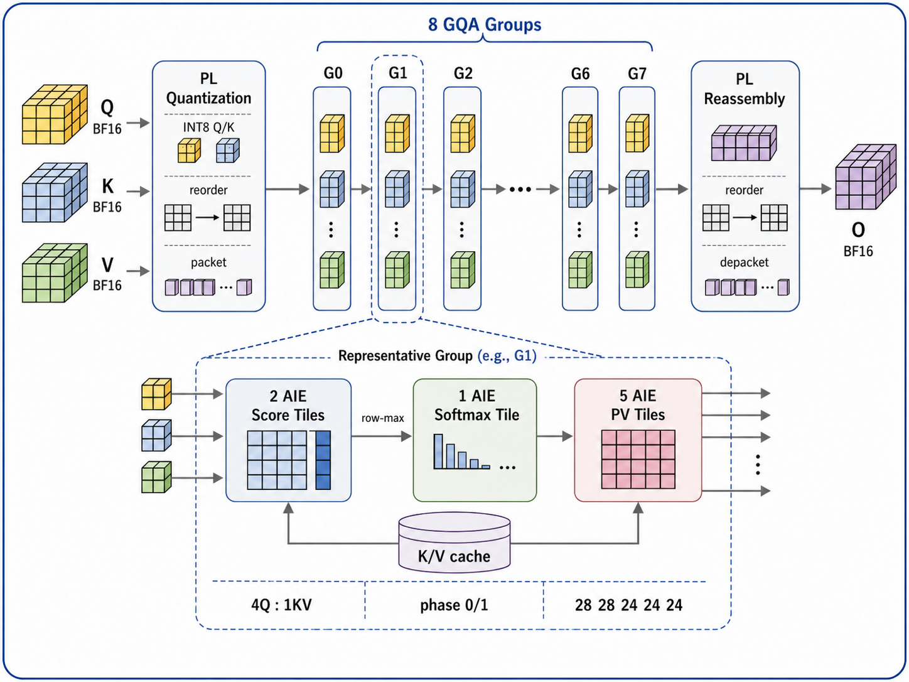

# AIE-FlashStream — Llama3-8B GQA Attention Accelerator

AIE-FlashStream is the project name of our streaming GQA attention accelerator. The term “FlashStream” denotes the streaming hardware dataflow and does not imply an implementation of the FlashAttention algorithm.



This repository contains the complete source code (`aie/`, `host/`, `pl/`, `link/`) and prebuilt binary (`llama3_attention.xclbin`) for the Llama3-8B GQA Attention Accelerator on the AMD Versal VCK5000 board.

## Architecture Highlights

- **Workload**: Batch-configurable, Sequence Length = 32, Query Heads = 32, KV Heads = 8 (GQA 4:1 ratio), Head Dimension = 128.
- **Compute Precision**:
  - **Q/K Score GEMM**: INT8 × INT8 accumulated into INT32 in AIE vector compute.
  - **Softmax / P*V Accumulation**: FP32 internal precision with BF16 input/output rounding.
- **AIE Topology**: 64 mapped active AIE compute tiles across 8 GQA groups (2 score, 1 softmax, 5 value/update lanes per group).
- **PL Streaming Shell**: 5-slice parallel packetized streaming interface to AIE with 4-plane 512-bit DDR output reconstruction.
- **Frequency**: 300 MHz PL & AIE domain clocking.

## Repository Structure

- `aie/`: AI Engine graph, kernels (score, fused softmax, value), and tile layout specifications.
- `pl/`: HLS PL shell kernel, packetizer, and quantizer logic.
- `link/`: Vitis link connectivity config files (`eight_groups_packet.cfg`).
- `host/`: Host benchmark application built with standard XRT C++ APIs.
- `figures/`: Architecture diagrams and illustrations.
- `llama3_attention.xclbin`: Prebuilt board-tested 300 MHz accelerator image for VCK5000.
- `tests/`: Reference CPU PyTorch/Python attention oracle and transport testbenches.
- `reports/`: Timing and HLS synthesis summaries.

## Quick Start

```bash
make
./host/llama3_attention_host.exe --xclbin llama3_attention.xclbin
```
